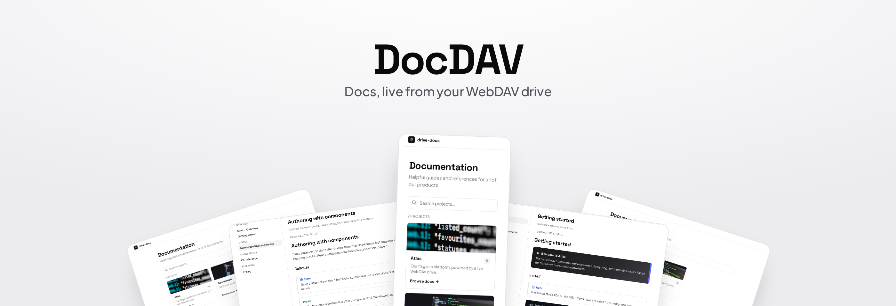

Turn any WebDAV drive into a clean, modern documentation site for your
products. You keep writing plain Markdown in your own cloud storage (or a
self-hosted server); DocDAV reads it over standard WebDAV and renders it as
fast, searchable, per-product docs. Edit a file, refresh the page, and it is
live. No rebuild, no build pipeline, no extra moving parts.

Each folder on the drive becomes a product, declared by a small `docs.yaml`
manifest at the product root that lists its pages, categories and ordering.
The site renders those pages from **Markdown, plain text, raw HTML, AsciiDoc,
CSV, .docx and .xlsx**, and serves per-product access control automatically.
A product without a manifest contributes nothing; files not listed in a
manifest are ignored — no build step, no hidden auto-includes.

Because it speaks standard WebDAV, it works out of the box with most cloud
storage and file servers:

- **Self-hosted**: Nextcloud, ownCloud, and any WebDAV-enabled server.
- **Managed / hosted**: Infomaniak kDrive, pCloud, Yandex.Disk, Koofr,
  Internxt, HiDrive, and others.

See [docs/](docs/) for full technical documentation (content model,
components, configuration).

## Run it

```bash
docker run -d --name docdav -p 4323:4323 \
  -e WEBDAV_URL="https://<host>/<base>/<docsRoot>/" \
  -e WEBDAV_USER="user" \
  -e WEBDAV_PASS="pass" \
  ghcr.io/pasc4le-labs/docdav:<tag>
```

A Docker Compose example ships as [docker-compose.yml](docker-compose.yml).

## License

Licensed under the **EUPL v1.2**, the European Union Public Licence.
