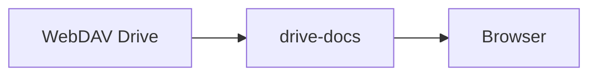

# Authoring with components

Every page on the docs site renders from plain Markdown, but supports a few
extra building blocks. Here's what each one looks like and when to use it.

## Callouts

> [!NOTE]
> This is a **Note** callout. Use it for helpful context that the reader
> doesn't strictly need to act on.

> [!TIP] Pro tip
> Callouts accept a custom title after the type, and full Markdown in the body.

> [!IMPORTANT]
> Use **Important** when the reader must do something for it to keep working.

> [!WARNING]
> **Warning** flags something that can go wrong — like an upcoming breaking
> change or a footgun in a config value.

> [!CAUTION]
> **Caution** is for the serious stuff: data loss, security consequences, or
> irreversible actions. Reserved for the highest-stakes callouts.

## Banner

> [!BANNER] v2.4 is now live
> The new sync engine is out of beta in this release. Read the
> [command reference](reference/cli) for the updated flags, then upgrade when
> you're ready.

## Numbered procedure

Callouts are nice, but the core of any doc is the how-to. Write a plain
ordered list and it becomes a step list with auto-numbered badges:

To configure an API key:

1. Open the **Settings** page.
2. Click **API Keys** → **Create key**.
3. Choose a scope: `read`, `write`, or `admin`.
4. Copy the generated key — it's shown only once.
5. Paste it into your environment as `ATLAS_TOKEN`.

Nested steps work too:

1. First, sign in.
2. Then complete the setup:
   1. Pick a data directory.
   2. Point Atlas at your WebDAV share.
   3. Run `atlas run`.
3. Open your browser and confirm the health check.

## Toggles

Collapsible sections keep references tidy — questions, optional deep-dives and
prolonged options hide behind a heading until the reader expands them.

:::toggle Can I self-host Atlas?
Yes — `atlas run` runs anywhere you like. Atlas talks to your own WebDAV drive,
so there's no cloud dependency by default. See [Deployment](deployment) for the
full checklist.
:::

:::toggle What happens to my data on the drive?
Nothing. Docs are read on every request and never written back. Your drive is
the source of truth and the site is a read-only renderer.
:::

:::toggle Why do I only have read access?
The platform is intentionally read-only for visitors. Publishing edits happen
on the drive itself; the site reflects them instantly on refresh.
:::

## Images

A diagram or screenshot is just standard Markdown. Include it from anywhere
the browser can reach — a public URL, or `/images/…` if you drop the file in
the app's static folder. Images are responsive, rounded, and kept within the
content column:


```markdown

```

## Diagrams

You can embed two kinds of diagrams directly in Markdown, no build step needed.

### Mermaid

Fence a block with <code>```mermaid</code> — it renders to an SVG on the client
(a small library loads only on pages that use it):



### Excalidraw

Fence an Excalidraw scene (JSON) with <code>```excalidraw</code> — it renders to a
self-contained inline SVG (no build step, no external service):

```excalidraw
[
  {
    "type": "rectangle", "id": "dav", "x": 60, "y": 120, "width": 220, "height": 80,
    "roundness": { "type": 3 }, "backgroundColor": "#a5d8ff", "fillStyle": "solid",
    "boundElements": [{ "id": "t-dav", "type": "text" }]
  },
  {
    "type": "text", "id": "t-dav", "x": 65, "y": 140, "width": 210, "height": 40,
    "text": "WebDAV Drive", "fontSize": 20, "fontFamily": 1,
    "textAlign": "center", "verticalAlign": "middle",
    "containerId": "dav", "originalText": "WebDAV Drive", "autoResize": true
  },
  {
    "type": "arrow", "id": "a1", "x": 280, "y": 160, "width": 120, "height": 0,
    "points": [[0, 0], [120, 0]], "endArrowhead": "arrow"
  },
  {
    "type": "rectangle", "id": "app", "x": 400, "y": 120, "width": 220, "height": 80,
    "roundness": { "type": 3 }, "backgroundColor": "#d0bfff", "fillStyle": "solid",
    "boundElements": [{ "id": "t-app", "type": "text" }]
  },
  {
    "type": "text", "id": "t-app", "x": 405, "y": 140, "width": 210, "height": 40,
    "text": "drive-docs", "fontSize": 20, "fontFamily": 1,
    "textAlign": "center", "verticalAlign": "middle",
    "containerId": "app", "originalText": "drive-docs", "autoResize": true
  },
  {
    "type": "arrow", "id": "a2", "x": 620, "y": 160, "width": 120, "height": 0,
    "points": [[0, 0], [120, 0]], "endArrowhead": "arrow"
  },
  {
    "type": "rectangle", "id": "browser", "x": 740, "y": 120, "width": 220, "height": 80,
    "roundness": { "type": 3 }, "backgroundColor": "#b2f2bb", "fillStyle": "solid",
    "boundElements": [{ "id": "t-browser", "type": "text" }]
  },
  {
    "type": "text", "id": "t-browser", "x": 745, "y": 140, "width": 210, "height": 40,
    "text": "Browser", "fontSize": 20, "fontFamily": 1,
    "textAlign": "center", "verticalAlign": "middle",
    "containerId": "browser", "originalText": "Browser", "autoResize": true
  }
]
```

## The syntax at a glance

```markdown
> [!NOTE] Optional title
> Body markdown…

:::toggle Clickable heading
Body markdown…
:::
```
